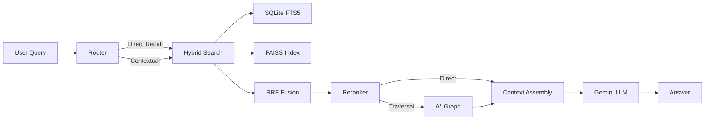

# GraphRAG Pipeline — Walkthrough

## What Was Built

A complete Context-Aware Agentic GraphRAG system for the Vadapav notes app, consisting of **12 Python modules** across 3 phases.

### Architecture

### Modules

| Module | Purpose |
|--------|---------|
| [schema.py](file:///c:/Users/ADMIN/Development/Projects/Project%201/rag/schema.py) | SQLite schema, FTS5, migrations, config |
| [embeddings.py](file:///c:/Users/ADMIN/Development/Projects/Project%201/rag/embeddings.py) | Gemini embeddings + FAISS index |
| [search.py](file:///c:/Users/ADMIN/Development/Projects/Project%201/rag/search.py) | Hybrid FTS5 + FAISS with RRF fusion |
| [edges.py](file:///c:/Users/ADMIN/Development/Projects/Project%201/rag/edges.py) | Edge inference (tags, backlinks, semantic) |
| [indexer.py](file:///c:/Users/ADMIN/Development/Projects/Project%201/rag/indexer.py) | Incremental re-indexing with daemon |
| [graph.py](file:///c:/Users/ADMIN/Development/Projects/Project%201/rag/graph.py) | NetworkX DiGraph + A* traversal |
| [reranker.py](file:///c:/Users/ADMIN/Development/Projects/Project%201/rag/reranker.py) | Gemini LLM-as-judge reranking |
| [router.py](file:///c:/Users/ADMIN/Development/Projects/Project%201/rag/router.py) | Agentic query routing + optimizer |
| [context.py](file:///c:/Users/ADMIN/Development/Projects/Project%201/rag/context.py) | Token-budgeted context assembly |
| [llm.py](file:///c:/Users/ADMIN/Development/Projects/Project%201/rag/llm.py) | Gemini answer synthesis |
| [commands.py](file:///c:/Users/ADMIN/Development/Projects/Project%201/rag/commands.py) | Pipeline orchestrator |
| [evaluation.py](file:///c:/Users/ADMIN/Development/Projects/Project%201/rag/evaluation.py) | Benchmark harness |

## API Switch: OpenAI → Google Gemini

All modules use `google-genai` SDK:
- **Embeddings**: `gemini-embedding-001` (768-dim)
- **LLM/Reranking/Routing**: `gemini-2.0-flash`

## Testing Results

**20/20 unit tests passing** in 5.25s:

| Test Suite | Tests | Status |
|------------|-------|--------|
| SQLite CRUD & FTS5 | 9 | ✅ |
| Edge inference (tags + semantic) | 3 | ✅ |
| FAISS (add/search/save/load/filter/rebuild) | 4 | ✅ |
| RRF fusion | 1 | ✅ |
| Content hashing | 2 | ✅ |
| A* traversal | 1 | ✅ |

## Setup

Virtual environment `.venv` created with all dependencies installed. Full setup instructions in [README.md](file:///c:/Users/ADMIN/Development/Projects/Project%201/README.md).
