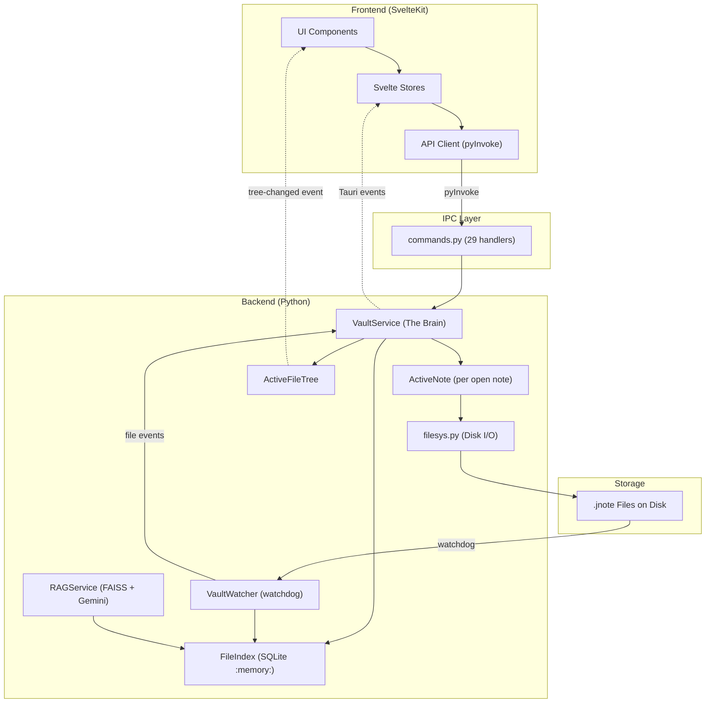

# Sushi Notes App — Technical Architecture Deep Dive

> A comprehensive guide for any developer trying to understand the codebase.

---

## 1. What Is Sushi?

Sushi is a **local-first, block-based note-taking application** that stores notes as individual `.jnote` JSON files on disk. It features:

- Rich text editing (markdown, LaTeX, code blocks, todos)
- Hierarchical file tree with drag-and-drop
- Full-text keyword search + semantic search (FAISS + Gemini embeddings)
- RAG-powered AI assistant (Ask AI sidebar)
- Real-time filesystem watching with hot-swap on external edits

---

## 2. Technology Stack

| Layer | Technology | Purpose |
|---|---|---|
| **Desktop Shell** | Rust / Tauri v2 | Window management, system integration |
| **Backend Logic** | Python 3.x (embedded via PyO3) | All business logic, file I/O, search |
| **IPC Bridge** | `tauri-plugin-pytauri-api` | Type-safe frontend ↔ Python commands |
| **Frontend** | SvelteKit (Svelte 5) + TypeScript | UI components, state management |
| **Styling** | TailwindCSS v4 | Utility-first CSS |
| **Icons** | Lucide-Svelte | SVG icon library |
| **Build** | Vite (frontend), Cargo (Tauri shell) | Dev server + production bundling |
| **Python Env** | `uv` (or pip) | Dependency management |

### Key Python Dependencies
- `watchdog` — filesystem observer
- `pydantic` — IPC request/response models
- `ijson` — streaming JSON parser (fast metadata extraction)
- `faiss-cpu` — vector similarity search
- `google-generativeai` — Gemini embedding API

---

## 3. Directory Structure

```
sushi/
├── src/                          # SvelteKit Frontend
│   ├── app.html                  # HTML shell
│   ├── routes/+page.svelte       # Single page app entry
│   └── lib/
│       ├── client/               # API client layer (pyInvoke wrappers)
│       │   ├── _apiTypes.d.ts    # Generated TypeScript types
│       │   ├── apiClient.ts      # Note/tree CRUD + search commands
│       │   └── ragApiClient.ts   # RAG-specific commands
│       ├── components/
│       │   ├── layout/           # Page layout (NavRail, LeftPanel, MainArea, RightPanel)
│       │   ├── editor/           # Block components (RichTextBlock, LaTeXBlock, etc.)
│       │   ├── search/           # SearchModal
│       │   ├── splash/           # SplashScreen
│       │   └── chat/             # AI ChatPanel
│       ├── editor/               # Editor utilities (constants, block factory)
│       ├── stores/               # Svelte stores (notes, layout, search, RAG, etc.)
│       └── utils/                # Shared utilities (type guards)
│
├── src-tauri/                    # Tauri Shell
│   ├── src/
│   │   ├── lib.rs                # Tauri plugin setup + PyTauri registration
│   │   └── main.rs               # Windows entry point
│   └── src-python/sushi/         # Python Backend Package
│       ├── __init__.py           # App lifecycle (setup, main)
│       ├── vault_service.py      # Core state: VaultService, ActiveNote, ActiveFileTree
│       ├── commands.py           # 29 IPC command handlers
│       ├── models.py             # Pydantic request/response models
│       ├── note_schema.py        # JNote/NoteBlock/NoteMetadata dataclasses
│       ├── cache_db.py           # In-memory SQLite index (FileIndex)
│       ├── filesys.py            # Disk I/O + CRUD operations
│       ├── watcher.py            # Filesystem observer (watchdog)
│       ├── logger.py             # Structured logging
│       ├── rag_service.py        # RAG engine (FAISS + Gemini)
│       ├── search_service.py     # FTS5 keyword search
│       └── rag_config.json       # RAG/embedding configuration
│
├── sample_notes/                 # Default vault directory (.jnote files)
├── documentations/               # Project documentation
└── README.md
```

---

## 4. Architecture Overview

The app follows a **service-oriented monolith** pattern where a single `VaultService` instance owns all application state.



---

## 5. Backend Deep Dive

### 5.1 Application Lifecycle (`__init__.py`)

The `setup()` function runs during app startup:

1. **Create `VaultService`** with the vault path and `AppHandle`
2. **Start `VaultService`** — triggers initial disk scan → populates `FileIndex`
3. **Create `RAGService`** — initializes FAISS index, starts indexer daemon
4. **Wire RAG hook** — monkey-patches the watcher callback to also trigger incremental indexing on note saves
5. **Emit `vault-ready`** — signals the frontend to show the main UI

### 5.2 VaultService — The Brain (`vault_service.py`)

The central orchestrator. Owns:

| Component | Type | Purpose |
|---|---|---|
| `db` | `FileIndex` | In-memory SQLite index of all notes and directories |
| `watcher` | `VaultWatcher` | Filesystem observer (watchdog) |
| `file_tree` | `ActiveFileTree` | Emits `tree-changed` events to frontend |
| `_active_notes` | `Dict[str, ActiveNote]` | Registry of currently open notes |
| `_saving_note_ids` | `set` | Echo suppression guard |

**Key methods:**
- `open_note(note_id)` → Creates an `ActiveNote`, loads from disk
- `close_note(note_id)` → Flushes pending saves, removes from registry
- `on_file_event(path, mtime)` → Router for watcher events (note changes, deletions, structural moves)
- `create_note()` / `create_note_in_dir()` → File creation + DB registration
- `delete_note()` / `delete_directory()` → File removal + active note cleanup

### 5.3 ActiveNote — Open Note State

Each open note gets an `ActiveNote` instance that handles:

1. **Loading** — Reads `.jnote` from disk via `filesys.load_jnote()`
2. **Editing** — `update_content(title, blocks)` merges frontend state
3. **Auto-save** — Debounced 2.5s timer, saves via `filesys.update_note()`
4. **Echo Suppression** — When saving, records the expected `mtime`. If the watcher reports the same `mtime`, the event is suppressed (it's our own write, not an external edit)
5. **Hot Swap** — If an external edit IS detected, reloads from disk in a background thread and emits a `note-content-changed` event

### 5.4 FileIndex — In-Memory Database (`cache_db.py`)

An SQLite `:memory:` database with two tables:

```sql
notes(note_id PK, note_title, note_version, note_dir)
directories(dir_path PK, dir_name, parent_path)
```

Rebuilt from scratch on every app launch via `VaultWatcher.scan()`. Provides fast directory listing and note lookup without scanning the filesystem on every request.

### 5.5 Filesystem Layer (`filesys.py`)

Pure functions for disk I/O:

| Function | Purpose |
|---|---|
| `load_jnote` / `save_jnote` | Read/write `.jnote` JSON files |
| `generate_filename` | `{slug}-{short_id}.jnote` naming convention |
| `extract_short_id` | Parse the 7-char UUID prefix from filenames |
| `get_note_filepath` | Resolve note_id → file path via DB + fallback glob |
| `create_new_note` | Factory: `JNote.create_new()` → `save_jnote()` |
| `update_note` | Save + title-drift rename + returns mtime for echo suppression |
| `move_item` | Move with collision/cycle detection |
| `duplicate_note` | Deep copy with new UUID + "Copy of" prefix |
| `rename_note` / `rename_directory` | On-disk rename |

### 5.6 Watcher (`watcher.py`)

Uses `watchdog.Observer` with a `VaultEventHandler` that:

1. **Created** → Registers note/dir in `FileIndex`, fires callback
2. **Modified** → Re-parses metadata, updates `FileIndex`
3. **Deleted** → Removes from `FileIndex` using short-ID lookup
4. **Moved** → Updates DB path, stamps `last_known_path`

**Copy Detection:** When a `.jnote` appears at a different path than its `last_known_path` AND the old file still exists, it's a copy. The watcher assigns a new UUID and renames the file to avoid ID collisions.

### 5.7 Note File Format (`.jnote`)

```json
{
  "metadata": {
    "note_id": "uuid-v4",
    "title": "My Note",
    "created_at": "ISO-8601",
    "last_modified": "ISO-8601",
    "version": "1.0",
    "status": 0,
    "tags": [],
    "last_known_path": "/absolute/path/to/file.jnote"
  },
  "blocks": [
    {
      "block_id": "short-hex-id",
      "type": "text|todo|code|latex|image",
      "data": { "content": "..." },
      "version": "1.0",
      "tags": [],
      "backlinks": []
    }
  ],
  "custom_fields": {}
}
```

### 5.8 IPC Commands (`commands.py`)

29 registered command handlers, each decorated with `@commands.command()`:

| Category | Commands |
|---|---|
| **Note CRUD** | `get_sidebar`, `open_note`, `create_note`, `update_note_content`, `delete_note_cmd` |
| **Block CRUD** | `add_block`, `update_block`, `delete_block` (backend-only; frontend does block ops locally) |
| **File Tree** | `get_directory_contents`, `create_note_in_dir`, `create_directory_cmd`, `delete_directory_cmd`, `move_item_cmd`, `move_note_cmd`, `duplicate_note_cmd`, `rename_note_cmd`, `rename_directory_cmd` |
| **Search** | `search_fast` (FTS5), `search_deep` (FAISS) |
| **RAG** | `rag_query`, `rag_build_index`, `rag_status` |

---

## 6. Frontend Deep Dive

### 6.1 Component Hierarchy

```
+page.svelte
└── SplashScreen.svelte (overlay, fades out on vault-ready)
    NavRail.svelte (left icon strip)
    LeftPanel.svelte (file tree sidebar)
    └── FileTreeNode.svelte (recursive tree nodes)
    MainArea.svelte (editor)
    └── BlockToolbar.svelte (formatting bar)
        BlockInserter.svelte (+ button)
        RichTextBlock.svelte (text/todo blocks)
        LaTeXBlock.svelte (math blocks)
        CodeBlock.svelte (code blocks)
        GhostBlock.svelte (drag placeholder)
    RightPanel.svelte (details + AI sidebar)
    └── ChatPanel.svelte (RAG chat)
    SearchModal.svelte (Ctrl+K)
```

### 6.2 State Management

State is managed via **Svelte writable stores** (not Svelte 5 runes for global state):

| Store | Purpose |
|---|---|
| `notesStore.ts` | Note list, active note content, save/load/delete actions |
| `layoutStore.ts` | Panel open/close, widths, active tab, search modal |
| `fileTreeStore.ts` | Expanded dirs, selected dir, tree refresh counter |
| `searchStore.ts` | Search query, results, loading state |
| `ragStore.ts` | RAG chat messages, index status |
| `blockDragStore.ts` | Block reorder drag state |
| `dragStore.ts` | File tree drag state |
| `toastStore.ts` | Notification toasts |

### 6.3 Non-Reactive Editing (Critical Design Decision)

`MainArea.svelte` deliberately uses **plain JavaScript variables** (not `$state()`) for block content during editing:

```typescript
// NOT reactive — mutations don't trigger re-renders
let blockContents: Record<string, string> = {};
let currentTitle: string = "";
let currentBlocks: NoteBlock[] = [];
```

**Why:** Svelte reactivity would re-render the entire block list on every keystroke, destroying `contenteditable` caret position and causing input lag. Instead:

1. Block components own their `contenteditable` DOM
2. Content changes are captured via `oninput` into the plain JS map
3. Saves are triggered via a debounced `triggerSave()` that reads from the map
4. The `showBlocks` toggle (`rerenderBlocks()`) forces a destroy/recreate cycle only when structural changes occur (add/delete/reorder)

### 6.4 API Client Layer (`lib/client/`)

Three files:
- **`_apiTypes.d.ts`** — Generated TypeScript interfaces matching Python Pydantic models
- **`apiClient.ts`** — Wraps `pyInvoke()` for all note/tree/search commands
- **`ragApiClient.ts`** — Wraps `pyInvoke()` for RAG commands

All frontend ↔ backend communication goes through `pyInvoke(commandName, body)`.

### 6.5 Backend → Frontend Events

The backend pushes events to the frontend via Tauri's event system:

| Event | Payload | Trigger |
|---|---|---|
| `vault-ready` | `{}` | Backend initialization complete |
| `tree-changed` | `{ path, eventType }` | File/dir created, moved, or deleted |
| `note-content-changed` | `{ noteId }` | External edit detected (hot swap) |

Frontend listens via `@tauri-apps/api/event`.listen()`.

---

## 7. Data Flow Examples

### 7.1 User Edits a Note

```
User types → contenteditable oninput
  → blockContents[blockId] = newText (plain JS, no re-render)
  → triggerSave() called
  → saveNoteContentDebounced(title, blocks) [500ms debounce]
  → pyInvoke("update_note_content", { noteId, title, blocks })
  → commands.update_note_content()
  → ActiveNote.update_content(title, blocks)
  → ActiveNote._schedule_save() [2.5s timer]
  → ActiveNote._save_to_disk()
    → mark_saving(noteId)  // echo suppression
    → filesys.update_note(db, jnote) → write to disk
    → unmark_saving(noteId)
  → watchdog fires on_modified
  → VaultService.on_file_event() checks _saving_note_ids → SUPPRESSED
```

### 7.2 External Edit Detected

```
External editor modifies .jnote file
  → watchdog fires on_modified
  → VaultEventHandler._process_note_file()
  → Updates FileIndex
  → Calls VaultService.on_file_event(path, new_mtime)
  → ActiveNote.handle_external_update(mtime)
  → mtime ≠ _last_save_mtime → EXTERNAL CHANGE
  → _trigger_hot_swap() → background thread reloads file
  → Emits "note-content-changed" event
  → Frontend notesStore receives event
  → MainArea.svelte reinitializes view from reloaded data
```

### 7.3 File Tree Navigation

```
LeftPanel renders FileTreeNode (root, isRoot=true)
  → fetchContents() → pyInvoke("get_directory_contents", { dirPath: null })
  → commands.get_directory_contents()
  → FileIndex.get_directory_contents(vault_path) → { subdirs: [], notes: [] }
  → FileTreeNode recursively renders subdirectories
  → Click note → loadNote(noteId) → pyInvoke("open_note") → ...
```

---

## 8. Key Patterns & Conventions

### Echo Suppression
Prevents watchdog from treating our own saves as external edits. Uses `_saving_note_ids` set + `_last_save_mtime` timestamp comparison.

### Hold-to-Drag
Both file tree and block reorder use a mousedown timer pattern (300ms hold) instead of HTML5 drag-and-drop (which is unreliable in WebView2).

### Incremental RAG Indexing
The `__init__.py` monkey-patches the watcher callback to also trigger `rag_service.on_note_saved()` on every note modification. This runs embeddings in a background daemon thread.

### Filename Convention
`.jnote` files use: `{slug}-{short_id}.jnote` where `slug` is a URL-safe title excerpt and `short_id` is the first 7 chars of the note UUID. Example: `neural-networks-deep-dive-b37c664.jnote`.

---

## 9. Configuration

| Setting | Location | Default |
|---|---|---|
| Vault path | `__init__.py` / `SUSHI_VAULT_PATH` env | `sample_notes/` |
| RAG config | `src-tauri/rag_config.json` | Gemini model, chunk size, etc. |
| RAG hyperparams | `src-tauri/rag_hyperparams.json` | Similarity thresholds |
| Auto-save delay | `ActiveNote._SAVE_DELAY` | 2.5 seconds |
| Save debounce | `notesStore.ts` | 500ms |

---

## 10. Known Limitations

1. **No automated tests** — frontend and backend rely on manual smoke testing
2. **In-memory database** — `FileIndex` is rebuilt on every launch (no persistence)
3. **Single vault** — no multi-vault or vault switching UI
4. **Hardcoded dev path** — `VAULT_PATH` defaults to a developer's local path
5. **`MainArea.svelte`** — still ~850 lines; block operations could be further extracted
6. **No offline-first sync** — purely local, no cloud backup
