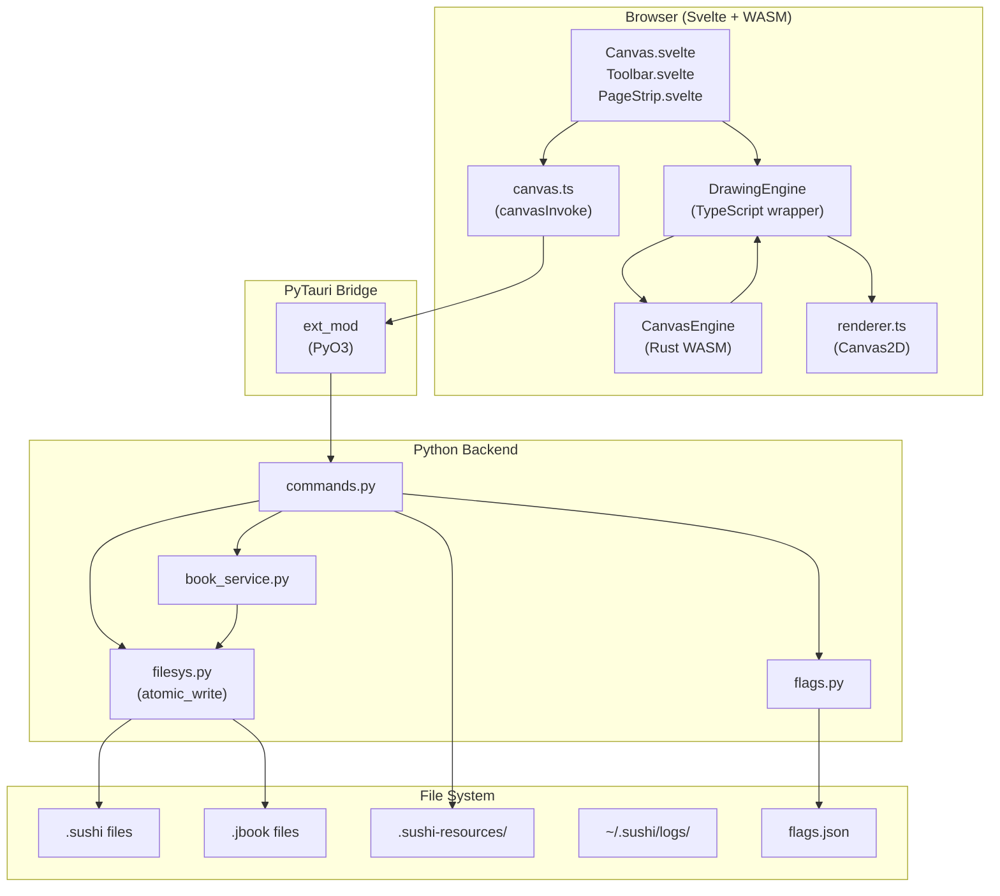

# Sushi Canvas — Complete Project Report

> **Purpose:** This document is a comprehensive technical reference for integrating the **Sushi Canvas** drawing engine into the main **Sushi Notes** PyTauri app. It covers every layer of the architecture — from file formats and data structures to rendering pipelines and IPC contracts — so that an AI agent can understand the project fully and perform the integration without missing hidden dependencies.

---

## 1. Project Identity & Stack

| Attribute | Value |
|---|---|
| **Name** | `sushi-canvas` |
| **Version** | `0.1.0` |
| **App Identifier** | `dev.arew3y.canvas` |
| **License** | MIT |
| **Framework** | Tauri v2 + PyTauri v0.8 |
| **Frontend** | SvelteKit 5 (SPA mode via `adapter-static`) |
| **Build Tool** | Vite 6 |
| **Backend (native)** | Rust (Tauri shell + PyO3 bridge) |
| **Backend (logic)** | Python 3.9+ (via PyTauri — Pydantic, structlog) |
| **WASM Engine** | Rust → `wasm-bindgen` → `canvas-engine/pkg` |
| **Package Manager** | pnpm (JS), uv (Python), Cargo (Rust) |

### 1.1 — Why Three Languages?

The architecture uses a **"tri-runtime"** pattern:

1. **Rust WASM (`canvas-engine`)** — All performance-critical, stateful drawing logic runs in-browser as WASM. This includes stroke generation, hit testing, selection transforms, undo/redo, and serialization. It runs at ~60fps with zero network latency.
2. **Python (`sushi_canvas`)** — All file I/O, notebook management, device profiles, feature flags, logging, and crash-safe persistence. Python handles everything that touches the filesystem or needs to survive a crash.
3. **Svelte/TypeScript (`src/lib/`)** — All UI rendering, pointer event handling, viewport overlays, text editing DOM, and IPC orchestration. Svelte owns the DOM and Canvas2D rendering pipeline.

The **Rust Tauri shell** (`src-tauri/src/`) is a thin launcher that initializes PyO3, loads the Python virtual environment, and starts the Tauri window. It has almost no application logic.

---

## 2. Repository Structure

```
sushi-canvas/
├── canvas-engine/              ← Rust WASM crate (core drawing engine)
│   ├── Cargo.toml              ← cdylib, wasm-bindgen + serde
│   ├── pkg/                    ← WASM build output (consumed by Vite)
│   └── src/
│       ├── lib.rs              ← Module declarations + public re-export
│       ├── engine.rs           ← CanvasEngine struct + all #[wasm_bindgen] methods
│       ├── stroke.rs           ← Stroke data structure + CanvasObject impl
│       ├── text.rs             ← TextObject struct + CanvasObject impl
│       ├── image.rs            ← ImageObject struct + CanvasObject impl
│       ├── object.rs           ← CanvasObject trait + CanvasObjectEnum (tagged union)
│       ├── selection.rs        ← SelectionState + pure hit test / transform functions
│       ├── history.rs          ← Undo/redo stack + HistoryEntry enum
│       ├── drawing.rs          ← DrawingState (active stroke accumulation)
│       ├── freehand.rs         ← Pressure-sensitive outline generation (closed polygon)
│       ├── smoother.rs         ← Catmull-Rom spline + streamline + pressure simulation
│       ├── shapes.rs           ← Shape recognition (line, rect, circle, triangle)
│       ├── config.rs           ← StrokeConfig, ToolConfigs, EngineConstants
│       ├── viewport.rs         ← Pan/zoom state
│       ├── serialization.rs    ← JSON serialize/deserialize with legacy compat
│       ├── eraser.rs           ← Eraser hit test
│       ├── export.rs           ← SVG export
│       └── math.rs             ← AABB, circle polygon, lerp utilities
│
├── src/                        ← SvelteKit frontend
│   ├── app.html                ← HTML shell
│   ├── routes/                 ← SvelteKit route (single page)
│   └── lib/
│       ├── Canvas.svelte       ← Main canvas component (~34KB, core UI)
│       ├── Toolbar.svelte      ← Tool selection bar (~13KB)
│       ├── PageStrip.svelte    ← Notebook page tab strip (~10KB)
│       ├── engine.ts           ← DrawingEngine class (typed WASM wrapper)
│       ├── renderer.ts         ← Canvas2D rendering (base + active layers)
│       ├── actions.ts          ← Action handler dispatch (~17KB)
│       ├── input.ts            ← Pointer normalization, coalesced events
│       ├── types.ts            ← TypeScript interfaces & types
│       ├── config.ts           ← Shared render/default constants
│       ├── stores.ts           ← Svelte writable stores (feature flags)
│       ├── shortcuts.ts        ← Keyboard shortcut bindings
│       ├── client/
│       │   └── canvas.ts       ← IPC client (canvasInvoke wrapper)
│       └── tools/
│           ├── index.ts
│           ├── SelectionHandler.ts    ← Select tool state machine (~16KB)
│           ├── TextEditorHandler.ts   ← Text tool handler (~10KB)
│           └── GestureHandler.ts      ← Multi-finger gesture handler
│
├── src-tauri/                  ← Tauri + Rust + Python backend
│   ├── Cargo.toml              ← tauri, pyo3, pytauri deps
│   ├── tauri.conf.json         ← Window config, build config
│   ├── src/
│   │   ├── main.rs             ← PyTauri standalone launcher
│   │   └── lib.rs              ← ext_mod PyO3 module + builder_factory
│   └── src-python/
│       └── sushi_canvas/
│           ├── __init__.py     ← App entry: configure_logging → load_flags → register_commands
│           ├── __main__.py     ← python -m sushi_canvas entry point
│           ├── commands.py     ← ALL IPC command handlers (save/load/notebook/image)
│           ├── book_service.py ← .jbook notebook CRUD
│           ├── models.py       ← ok()/err() response envelope + error codes
│           ├── filesys.py      ← atomic_write + @timed decorator
│           ├── flags.py        ← Feature flag loader (flags.json)
│           ├── logging_config.py ← structlog setup
│           ├── migrations.py   ← Schema version migration runner
│           └── device_profiles.py ← Per-device stroke config persistence
│
├── flags.json                  ← Feature flag configuration file
├── Cargo.toml                  ← Workspace: [canvas-engine, src-tauri]
├── package.json                ← pnpm: SvelteKit + Tauri deps
├── vite.config.js              ← Alias: "canvas-engine" → ./canvas-engine/pkg
├── svelte.config.js            ← adapter-static, SPA mode
├── pyproject.toml              ← uv workspace: Python deps
└── tsconfig.json
```

---

## 3. Architecture Deep Dive

### 3.1 — Data Flow Diagram



### 3.2 — Rendering Pipeline

The canvas uses a **double-buffered** Canvas2D approach:

| Layer | Canvas | Purpose |
|---|---|---|
| **Base layer** | `baseCanvas` | All committed objects (strokes, text, images). Only re-rendered when `baseDirty = true`. |
| **Active layer** | `activeCanvas` | Live stroke preview, eraser cursor, selection handles, marquee rect. Re-rendered every frame. |
| **Text overlay** | DOM `<div>` | HTML `contenteditable` for text editing, positioned via CSS transforms matching viewport. |

**Rendering order (base layer):**
1. Apply viewport transform: `ctx.setTransform(dpr * scale, 0, 0, dpr * scale, ox * dpr, oy * dpr)`
2. Iterate `state.objects` in order (z-order = array index):
   - **Stroke**: Fill closed polygon path with `fillStyle = stroke.color`, `globalAlpha = stroke.opacity`
   - **Text**: `fillText()` per line, with rotation support
   - **Image**: `drawImage()` from `imageCache` map
3. Selected objects with a `liveTransform` get an additional canvas save/translate/rotate/scale/translate wrapper

**Active layer overlay (rendered every frame):**
1. Active stroke outline (live drawing preview)
2. Shift-snap guide line (dashed blue)
3. Eraser cursor circle
4. Marquee selection rectangle (marching ants)
5. Selection bounding box + 8 resize handles + rotate handle

---

## 4. Core Data Structures

### 4.1 — CanvasObjectEnum (Rust, tagged union)

This is the **single type** stored in the engine's `objects: Vec<CanvasObjectEnum>`. Every object on the canvas is one of these variants:

```rust
#[derive(Debug, Clone, Serialize, Deserialize)]
#[serde(tag = "object_type", rename_all = "snake_case")]
pub enum CanvasObjectEnum {
    Stroke(Stroke),
    Text(TextObject),
    Image(ImageObject),
}
```

The `object_type` discriminator tag is included in JSON serialization, enabling polymorph deserialization.

### 4.2 — CanvasObject Trait

All three object types implement this trait:

```rust
pub trait CanvasObject {
    fn id(&self) -> u64;
    fn object_type(&self) -> &'static str;
    fn bounding_box(&self) -> BoundingBox;
    fn hit_test(&self, x: f64, y: f64) -> bool;
    fn hit_test_rect(&self, x: f64, y: f64, w: f64, h: f64) -> bool;
    fn translate(&mut self, dx: f64, dy: f64);
    fn scale(&mut self, sx: f64, sy: f64, origin: (f64, f64));
    fn rotate(&mut self, angle_radians: f64, origin: (f64, f64));
    fn color(&self) -> &str;
    fn set_color(&mut self, color: &str);
    fn opacity(&self) -> f64;
    fn set_opacity(&mut self, opacity: f64);
    fn metadata(&self) -> Option<&HashMap<String, Value>>;
    fn set_metadata(&mut self, key: &str, value: Value);
    fn snapshot(&self) -> CanvasObjectEnum;
}
```

### 4.3 — Stroke

```rust
pub struct Stroke {
    pub id: u64,
    pub outline_points: Vec<[f64; 2]>,  // Closed polygon outline
    pub color: String,                   // CSS hex e.g. "#1a1a1a"
    pub opacity: f64,                    // 0.0..=1.0
    pub tool: StrokeTool,               // Pen | Highlighter | Marker
    pub aabb: [f64; 4],                 // [min_x, min_y, max_x, max_y]
    pub metadata: Option<HashMap<String, Value>>,  // Extensible metadata
    pub raw_points: Vec<InputPoint>,    // Transient (not serialized), for shape recognition
}
```

**Hit testing:** Uses ray-casting point-in-polygon for the outline polygon, with AABB early rejection.

### 4.4 — TextObject

```rust
pub struct TextObject {
    pub id: u64,
    pub x: f64, pub y: f64,
    pub w: f64, pub h: f64,
    pub content: String,
    pub font_family: String,
    pub font_size: f64,
    pub font_weight: u32,
    pub font_style: String,
    pub color: String,
    pub opacity: f64,
    pub align: TextAlign,       // Left | Center | Right
    pub rotation: f64,          // Radians
    pub metadata: Option<HashMap<String, Value>>,
}
```

### 4.5 — ImageObject

```rust
pub struct ImageObject {
    pub id: u64,
    pub resource_id: String,   // Links to .sushi-resources/<resource_id>
    pub x: f64, pub y: f64,
    pub w: f64, pub h: f64,
    pub original_w: f64, pub original_h: f64,
    pub opacity: f64,
    pub rotation: f64,
    pub metadata: Option<HashMap<String, Value>>,
}
```

### 4.6 — InputPoint (raw pointer data)

```rust
pub struct InputPoint {
    pub x: f64,
    pub y: f64,
    pub pressure: f64,       // 0.0..1.0, simulated if device doesn't provide
    pub timestamp_ms: f64,
}
```

### 4.7 — BoundingBox

```rust
pub struct BoundingBox {
    pub x: f64, pub y: f64,
    pub w: f64, pub h: f64,
}
```

Contains `contains_point()`, `intersects_rect()`, `union()`.

### 4.8 — Viewport

```rust
pub struct Viewport {
    pub offset_x: f64,
    pub offset_y: f64,
    pub scale: f64,       // 0.1..10.0
    pub min_scale: f64,   // 0.1
    pub max_scale: f64,   // 10.0
}
```

---

## 5. Stroke Generation Pipeline

The freehand drawing pipeline converts raw pointer events into filled polygon outlines. This is the core differentiator of the engine:

```
Raw PointerEvent
    ↓
normalizePointerEvent() — screen→canvas coordinate transform
    ↓
getCoalescedPoints() — interpolate high-frequency stylus events (240hz)
    ↓
engine.continue_stroke(x, y, pressure, time, shiftHeld)
    ↓ [inside WASM]
DrawingState.continue_stroke()
    ↓
simulate_pressure() — velocity-based pressure simulation for mouse input
    ↓
streamline() — exponential moving average smoothing
    ↓
catmull_rom_spline() — centripetal Catmull-Rom interpolation
    ↓
get_stroke_outline() — variable-width offset curve generation
    ↓ (left/right outlines + rounded caps)
assemble_outline() — closed polygon ready for Canvas2D fill()
    ↓
← flat Vec<f64> returned to JS
    ↓
drawOutlinePoints() — render to active layer canvas
```

### 5.1 — Stroke Configuration (ToolConfigs)

Each tool (Pen, Highlighter, Marker) has independent tuning parameters:

```rust
pub struct StrokeConfig {
    pub max_velocity: f64,         // Velocity cap for pressure sim
    pub min_pressure: f64,         // Floor pressure value
    pub pressure_lerp: f64,        // Smoothing factor for pressure
    pub streamline_factor: f64,    // Position smoothing (0=none, 1=max)
    pub catmullrom_alpha: f64,     // Spline tension
    pub catmullrom_segments: u32,  // Interpolation resolution
    pub thinning: f64,            // Width variation by pressure
    pub smoothing: f64,           // (reserved)
    pub tapered_start: bool,      // Round start cap
    pub tapered_end: bool,        // Round end cap
    pub easing_start: EasingType, // Start taper easing
    pub easing_end: EasingType,   // End taper easing
}
```

**Default tool profiles:**

| Property | Pen | Highlighter | Marker |
|---|---|---|---|
| `thinning` | 0.7 | 0.1 | 0.4 |
| `streamline_factor` | 0.3 | 0.5 | 0.2 |
| `tapered_start` | true | false | false |
| `tapered_end` | true | false | true |
| `opacity` | 1.0 | 0.5 | 1.0 |
| `compositeOp` | source-over | multiply | source-over |

---

## 6. Engine API Surface

### 6.1 — CanvasEngine (WASM-exported methods)

The `CanvasEngine` struct is the single WASM export. The TypeScript `DrawingEngine` class wraps it with error checking. Here is the complete API:

#### Drawing
| Method | Signature | Description |
|---|---|---|
| `begin_stroke` | `(x, y, pressure, time)` | Start accumulating a new stroke |
| `continue_stroke` | `(x, y, pressure, time, shift_held) → Vec<f64>` | Add point, return live outline |
| `end_stroke` | `() → f64` | Commit stroke, return ID (0 if empty) |
| `cancel_stroke` | `()` | Discard active stroke |
| `replay_stroke` | `(rawPointsJson, configJson) → Vec<f64>` | Replay raw points with given config |

#### Color/Size/Tool
| Method | Signature | Description |
|---|---|---|
| `set_color` | `(color: &str)` | Set drawing color (CSS) |
| `set_size` | `(size: f64)` | Set stroke width |
| `set_tool` | `(tool: &str)` | "pen", "highlighter", "marker" |

#### Hit Testing
| Method | Signature | Description |
|---|---|---|
| `hit_test_point` | `(x, y) → f64` | Returns topmost object ID at point, -1 if none |
| `hit_test_rect` | `(x, y, w, h) → Vec<f64>` | Returns all object IDs fully inside rect |

#### Selection
| Method | Signature | Description |
|---|---|---|
| `set_selection` | `(ids: Vec<f64>)` | Replace selection |
| `add_to_selection` | `(ids: Vec<f64>)` | Add to selection |
| `remove_from_selection` | `(id: f64)` | Remove single |
| `clear_selection` | `()` | Deselect all |
| `get_selected_ids` | `() → Vec<f64>` | Get current selection |
| `has_selection` | `() → bool` | Quick check |
| `get_selection_bounds` | `() → Vec<f64>` | `[x1, y1, x2, y2]` or `[]` |

#### Transforms
| Method | Signature | Description |
|---|---|---|
| `commit_transform` | `(tx, ty, sx, sy, rotation)` | Apply transform to selected objects + push undo |

#### Object Operations
| Method | Signature | Description |
|---|---|---|
| `delete_selected` | `()` | Delete selected objects + push undo |
| `duplicate_selected` | `()` | Clone selected with 20px offset + push undo |
| `cancel_object` | `(id: f64)` | Silent remove (no undo) — for empty text cleanup |
| `get_all_objects` | `() → JsValue` | Serde-serialized array of all objects |
| `get_object` | `(id: f64) → String` | JSON of single object |

#### Color Change
| Method | Signature | Description |
|---|---|---|
| `get_selected_colors_json` | `() → String` | `{id: color}` map |
| `commit_color_change` | `(originalColorsJson, color)` | Apply color + push undo |
| `set_selected_color_preview` | `(color)` | Live preview (no undo) |
| `get_selected_color` | `() → String` | Uniform color or empty |

#### Eraser
| Method | Signature | Description |
|---|---|---|
| `get_strokes_at` | `(x, y, radius) → Vec<f64>` | Find strokes hit by eraser circle |
| `commit_erase` | `(ids: Vec<f64>)` | Delete strokes + push undo |

#### Undo/Redo
| Method | Signature | Description |
|---|---|---|
| `undo` | `() → bool` | Pop undo stack |
| `redo` | `() → bool` | Pop redo stack |
| `can_undo` | `() → bool` | Check |
| `can_redo` | `() → bool` | Check |

#### Viewport
| Method | Signature | Description |
|---|---|---|
| `pan` | `(dx, dy)` | Translate viewport |
| `zoom` | `(factor, cx, cy)` | Scale around point |
| `reset_viewport` | `()` | Reset to 1:1 |
| `get_viewport` | `() → Vec<f64>` | `[offsetX, offsetY, scale]` |

#### Text-Specific
| Method | Signature | Description |
|---|---|---|
| `add_text_object` | `(x, y) → f64` | Create empty text, return ID |
| `add_text_object_with_content` | `(x, y, content, styleJson) → f64` | Create with content |
| `get_text_object` | `(id) → String` | JSON of text object |
| `update_text_content` | `(id, content)` | Update + push undo |
| `update_text_content_live` | `(id, content)` | Update without undo (typing) |
| `update_text_style` | `(id, styleJson)` | Update style + push undo |
| `update_text_bounds` | `(id, w, h)` | Set measured dimensions |
| `delete_text_object` | `(id)` | Delete + push undo |
| `cancel_text_object` | `(id)` | Silent remove (empty text cleanup) |
| `translate_text_object` | `(id, dx, dy)` | Move + push undo |

#### Image-Specific
| Method | Signature | Description |
|---|---|---|
| `add_image_object` | `(resource_id, x, y, w, h, origW, origH) → f64` | Create image + push undo |

#### Notebook Pages
| Method | Signature | Description |
|---|---|---|
| `load_page` | `(json) → bool` | Load page content, swap history |
| `serialize_page` | `() → String` | Serialize page content |
| `stash_history` | `()` | Cache history before page switch |
| `get_current_page_id` | `() → String` | Current page ID |
| `set_current_page_id` | `(id)` | Set current page ID |

#### Shape Recognition
| Method | Signature | Description |
|---|---|---|
| `check_for_shape` | `(strokeId) → String` | JSON shape or empty |
| `replace_stroke_with_shape` | `(strokeId, shapeJson)` | Replace outline + push undo |
| `get_last_committed_stroke_id` | `() → f64` | Last stroke ID |

#### Config & Flags
| Method | Signature | Description |
|---|---|---|
| `set_tool_configs` | `(json) → bool` | Set per-tool stroke configs |
| `get_tool_configs` | `() → String` | Get current configs |
| `set_feature_flags` | `(json)` | Set feature flag map |

#### Error Handling
| Method | Signature | Description |
|---|---|---|
| `get_last_error` | `() → Option<String>` | Get last WASM error |
| `clear_last_error` | `()` | Clear error |

---

## 7. Undo/Redo System

The history system uses **snapshot-based undo** with a max stack depth of 100 entries. Each `HistoryEntry` variant captures enough state to reverse/replay:

```rust
pub enum HistoryEntry {
    AddObject { snapshot: CanvasObjectEnum },
    DeleteObjects { snapshots: Vec<CanvasObjectEnum> },
    TransformObjects { before_snapshots: Vec<CanvasObjectEnum> },
    SetProperty { before_snapshots: Vec<CanvasObjectEnum> },
    DuplicateObjects { snapshots: Vec<CanvasObjectEnum> },
    EditTextContent { id: u64, old_content: String, new_content: String },
    EditTextStyle { id: u64, old_style: TextStyleSnapshot, new_style: TextStyleSnapshot },
    ReplaceStrokeWithShape { stroke_id: u64, old_outline: Vec<[f64; 2]>, new_outline: Vec<[f64; 2]> },
}
```

**Key behaviors:**
- `push()` clears the redo stack (standard undo semantics)
- `undo()` swaps snapshots: captures "after" state, restores "before" state, pushes inverse to redo stack
- Per-page history: `stash_history()` caches the current history to `page_histories` map before switching pages

---

## 8. Serialization & File Formats

### 8.1 — `.sushi` (Single Canvas)

```json
{
  "schema_version": "1.0",
  "objects": [
    {
      "object_type": "stroke",
      "id": 1,
      "outline_points": [[100.0, 200.0], [101.5, 202.3], ...],
      "color": "#1a1a1a",
      "opacity": 1.0,
      "tool": "pen",
      "aabb": [95.0, 195.0, 450.0, 380.0]
    },
    {
      "object_type": "text",
      "id": 2,
      "x": 50.0, "y": 100.0,
      "w": 120.0, "h": 22.4,
      "content": "Hello",
      "font_family": "system-ui",
      "font_size": 16.0,
      "font_weight": 400,
      "font_style": "normal",
      "color": "#1a1a1a",
      "opacity": 1.0,
      "align": "Left",
      "rotation": 0.0
    },
    {
      "object_type": "image",
      "id": 3,
      "resource_id": "abc123.png",
      "x": 200.0, "y": 300.0,
      "w": 400.0, "h": 300.0,
      "original_w": 1920.0, "original_h": 1440.0,
      "opacity": 1.0,
      "rotation": 0.0
    }
  ],
  "next_id": 4
}
```

**Backward compat:** The deserializer tries three formats:
1. Current format (with `objects` array)
2. Legacy format (separate `strokes`, `text_objects`, `image_objects` arrays)
3. Bare strokes array

### 8.2 — `.jbook` (Multi-Page Notebook)

```json
{
  "metadata": {
    "file_id": "uuid",
    "title": "My Notebook",
    "created_at": "2026-03-29T...",
    "last_modified": "2026-04-01T...",
    "version": "1.0",
    "mode": "notebook"
  },
  "page_size": {
    "preset": "A4",
    "width_mm": 210,
    "height_mm": 297
  },
  "pages": [
    {
      "page_id": "uuid",
      "name": "Page 1",
      "order": 0,
      "background": { "type": "none" },
      "strokes": [...],
      "text_objects": [...],
      "image_objects": [...]
    }
  ],
  "resources": {}
}
```

### 8.3 — Image Resources

Images are stored as files in a `.sushi-resources/` directory alongside the canvas file:

```
my_drawing.sushi
.sushi-resources/
  abc123.png
  def456.jpg
```

The `resource_id` field on `ImageObject` maps to the filename in this directory.

---

## 9. IPC Command Reference

All commands use the `canvasInvoke()` wrapper which expects `{ status: "ok", data: T }` or `{ status: "error", code: string, message: string }` response envelopes.

### 9.1 — Canvas File I/O

| Command | Payload | Response | Description |
|---|---|---|---|
| `save_canvas` | `{ state_json: string }` | `{ path?, cancelled? }` | Save via file dialog |
| `load_canvas` | (none) | `{ state?, path?, cancelled? }` | Load via file dialog |
| `save_svg` | `{ svg_content: string }` | `{ path?, cancelled? }` | Export SVG |

### 9.2 — Image Resources

| Command | Payload | Response | Description |
|---|---|---|---|
| `import_canvas_image_cmd` | `{ image_data: int[], filename, canvas_path? }` | `{ resource_id, width, height, path }` | Save image to resources |
| `get_resource_bytes_cmd` | `{ resource_id, canvas_path? }` | `{ data: int[] }` | Load image bytes |

### 9.3 — Stroke Profiles

| Command | Payload | Response | Description |
|---|---|---|---|
| `get_stroke_config_cmd` | `{ pointer_type }` | `{ config?, is_default }` | Load device-specific config |
| `save_stroke_config_cmd` | `{ pointer_type, config }` | (ok) | Save device config |

### 9.4 — Feature Flags

| Command | Payload | Response | Description |
|---|---|---|---|
| `get_feature_flags_cmd` | (none) | `Record<string, any>` | Load flags from flags.json |

### 9.5 — Notebook Commands

| Command | Payload | Response |
|---|---|---|
| `create_book_cmd` | `{ title, page_size_preset }` | `{ book_id, path, first_page_id, cancelled? }` |
| `open_book_cmd` | `{ path }` | `BookInfo` |
| `get_page_cmd` | `{ book_id, page_id }` | `PageData` |
| `update_page_cmd` | `{ book_id, page_id, page_data_json }` | (ok) |
| `add_page_cmd` | `{ book_id, after_page_id, name? }` | `PageSummary` |
| `delete_page_cmd` | `{ book_id, page_id }` | (ok) |
| `rename_page_cmd` | `{ book_id, page_id, name }` | (ok) |
| `reorder_page_cmd` | `{ book_id, ordered_page_ids }` | (ok) |

### 9.6 — Error Logging

| Command | Payload | Response |
|---|---|---|
| `log_error_cmd` | `{ source, message, stack?, timestamp? }` | (ok) |

---

## 10. Feature Flags

Feature flags are loaded from `flags.json` (in the project root) at startup and propagated to both the Python backend and the WASM engine.

**Current flags:**

```json
{
  "enable_notebooks": true,
  "enable_text_tool": true,
  "enable_select_tool": true,
  "enable_shape_recognition": false,
  "enable_background_patterns": true
}
```

**Flag propagation flow:**
1. Python `flags.py` reads `flags.json` at startup via `load_flags()`
2. Frontend calls `get_feature_flags_cmd` → receives flag map
3. Frontend calls `engine.setFeatureFlags(JSON.stringify(flags))` → sets in WASM
4. WASM reads `self.feature_flags` in shape recognition paths

---

## 11. Tool System

### 11.1 — Available Tools

```typescript
type Tool = 'pen' | 'eraser' | 'highlighter' | 'marker' | 'cursor' | 'select' | 'text';
```

### 11.2 — Keyboard Shortcuts

| Key | Action |
|---|---|
| `P` | Pen tool |
| `E` | Eraser tool |
| `H` | Highlighter tool |
| `M` | Marker tool |
| `Ctrl+Z` | Undo |
| `Ctrl+Shift+Z` / `Ctrl+Y` | Redo |
| `Delete` / `Backspace` | Delete selected |
| `Escape` | Clear selection |
| `Ctrl+D` | Duplicate selected |
| `Arrow keys` | Nudge selected (1px, 10px with Shift) |

### 11.3 — Gesture Support

- **Two-finger pinch**: Zoom
- **Two-finger pan**: Viewport pan
- **Three-finger tap**: Undo
- **Four-finger tap**: Redo
- **Palm rejection**: stylus-only drawing when pen is detected

---

## 12. Input Handling

### 12.1 — Coordinate System

All engine objects exist in **canvas world space**. The viewport transform converts between screen and world:

```typescript
// Screen → World
canvasX = (logicalX - offsetX) / scale;
canvasY = (logicalY - offsetY) / scale;

// World → Screen
screenX = worldX * scale + offsetX;
screenY = worldY * scale + offsetY;
```

### 12.2 — Pointer Normalization

```typescript
function normalizePointerEvent(e, canvas, viewport): NormalizedPoint {
  // Returns world-space coordinates with pressure
  // Stylus: real pressure (e.pressure)
  // Mouse: neutral 0.5 (velocity-based pressure simulated in WASM)
}
```

### 12.3 — Coalesced Events

High-frequency stylus devices (240Hz) submit multiple pointer events per frame. `getCoalescedPoints()` captures all intermediate points with pressure interpolation:

```typescript
function getCoalescedPoints(e, canvas, viewport): NormalizedPoint[] {
  const coalesced = e.getCoalescedEvents?.() ?? [];
  // Interpolate pressure across coalesced points
}
```

---

## 13. Selection System

### 13.1 — State Machine

```typescript
type SelectState =
  | "idle"
  | "marquee"      // Dragging selection rectangle
  | "dragging"     // Moving selected objects
  | "resizing"     // Pulling a resize handle
  | "rotating"     // Rotating via rotate handle
```

### 13.2 — Transform Commit Pattern

Transforms follow a strict two-phase pattern:
1. **Visual phase (JS only)**: `liveTransform` in `RenderState` is updated every frame. No WASM calls.
2. **Commit phase (WASM, on pointerup)**: `engine.commitTransform(tx, ty, sx, sy, rotation)` applies to actual object data + pushes undo.

### 13.3 — Resize Handles

8 corner/edge handles + 1 rotate handle positioned above the top-center:

```
[0] —— [1] —— [2]
 |               |
[7]            [3]
 |               |
[6] —— [5] —— [4]
         ↑
       [rotate]
```

---

## 14. Constants & Sync Points

Several constants must stay in sync between Rust and TypeScript:

| Constant | Rust Location | TS Location | Value |
|---|---|---|---|
| Default color | `EngineConstants::default_stroke_color` | `DEFAULTS.COLOR` | `"#1a1a1a"` |
| Default font size | `EngineConstants::default_font_size` | `DEFAULTS.FONT_SIZE` | `16` |
| Default font family | `EngineConstants::default_font_family` | `DEFAULTS.FONT_FAMILY` | `"system-ui"` |
| Text line height | `TEXT_LINE_HEIGHT` | `RENDER.TEXT_LINE_HEIGHT` | `1.4` |
| Default stroke size | `EngineConstants::default_stroke_size` | `DEFAULTS.STROKE_SIZE` | `8` |

---

## 15. Python Backend Details

### 15.1 — App Startup Sequence

```python
# __init__.py
configure_logging()       # structlog → rotating file in ~/.sushi/logs/
load_flags()              # flags.json → _flags dict
commands = Commands()
register_commands(commands)

def main():
    with start_blocking_portal("asyncio") as portal:
        app = builder_factory().build(
            context=context_factory(),
            invoke_handler=commands.generate_handler(portal),
        )
        app.run_return()
```

### 15.2 — BookService (Notebook Manager)

- In-memory cache: `_open_books: dict[book_id → {data, path}]`
- All mutations auto-save via `atomic_write()`
- Page ordering uses fractional ordering (`(after_order + next_order) / 2`)
- Page size presets: A4 (210×297mm), Letter (216×279mm), A5 (148×210mm), Square (210×210mm)

### 15.3 — Error Codes

| Code | Usage |
|---|---|
| `CANVAS_NOT_FOUND` | Canvas file doesn't exist |
| `SAVE_FAILED` | File write error |
| `LOAD_FAILED` | File read/parse error |
| `INVALID_PAYLOAD` | Malformed IPC request |
| `RESOURCE_MISSING` | Image resource not found |
| `ENGINE_ERROR` | WASM engine error |
| `IMPORT_FAILED` | Image import error |

---

## 16. Build & Development

### 16.1 — Development Prerequisites

- **Rust** toolchain with `wasm-pack` (for building `canvas-engine`)
- **Python 3.9+** with `uv` package manager
- **Node.js** with `pnpm`
- **Tauri CLI** (`@tauri-apps/cli`)

### 16.2 — Vite Configuration

```javascript
// vite.config.js — key config
resolve: {
  alias: {
    "canvas-engine": path.resolve("./canvas-engine/pkg"),
  },
},
server: {
  port: 1420,
  strictPort: true,
  fs: { allow: ['..'] }  // Allow canvas-engine/pkg access
}
```

### 16.3 — Build Chain

1. `wasm-pack build canvas-engine --target web` → generates `canvas-engine/pkg/`
2. SvelteKit resolves `canvas-engine` via Vite alias
3. `pnpm build` → SvelteKit static build to `./dist/`
4. Tauri reads `./dist/` as `frontendDist`

### 16.4 — Tauri Configuration

```json
{
  "build": {
    "beforeDevCommand": "pnpm dev",
    "devUrl": "http://localhost:1420",
    "beforeBuildCommand": "pnpm build",
    "frontendDist": "../dist",
    "features": ["pytauri/standalone"]
  },
  "app": {
    "windows": [{ "title": "sushi-canvas", "width": 800, "height": 600 }],
    "security": { "csp": null }
  }
}
```

---

## 17. Integration Considerations for Sushi Notes

### 17.1 — What the Canvas Engine Needs

To function inside your main notes app, the canvas engine needs:

1. **WASM binary** — The `canvas-engine/pkg/` directory must be accessible to Vite. Configure the alias in your main app's `vite.config.js`.
2. **Python backend commands** — All commands from `commands.py` must be registered on the main app's `Commands` instance. This means merging `register_commands()` into your app's command registration.
3. **BookService singleton** — The `BookService` instance lives in-process. It needs to be shared or instantiated within the main app.
4. **Feature flags** — The flag file path and loading mechanism need to be unified.
5. **File system paths** — Resource directories (`.sushi-resources/`), log directories (`~/.sushi/logs/`), and device profile paths need to be consistent.

### 17.2 — What Can Be Reused As-Is

| Component | Reusability |
|---|---|
| `canvas-engine/` (entire crate) | **Drop-in** — Build as WASM, import via alias |
| `src/lib/engine.ts` | **Drop-in** — Pure WASM wrapper |
| `src/lib/renderer.ts` | **Drop-in** — Pure Canvas2D rendering |
| `src/lib/input.ts` | **Drop-in** — Pure pointer normalization |
| `src/lib/config.ts` | **Drop-in** — Pure constants |
| `src/lib/types.ts` | **Drop-in** — Pure TypeScript interfaces |
| `src/lib/shortcuts.ts` | **Drop-in** — Pure event handler |
| `src/lib/tools/` | **Drop-in** — Pure handler classes |
| `src/lib/Canvas.svelte` | **Embed** — Main component, wire to parent nav |
| `src/lib/Toolbar.svelte` | **Embed** — Can be placed in parent layout |
| `src/lib/PageStrip.svelte` | **Embed** — For notebook mode |
| `src/lib/client/canvas.ts` | **Merge** — IPC calls need `pyInvoke` from shared package |
| Python `commands.py` | **Merge** — Register on shared Commands instance |
| Python `book_service.py` | **Merge** — Singleton in shared process |
| Python `filesys.py` | **Merge** — Can be shared utility |
| Python `models.py` | **Merge** — Likely already exists in main app |

### 17.3 — Known Technical Debt

1. **Shape recognition** is feature-flagged to `false` — the algorithms work but the UX flow (800ms timer + toast confirmation) needs more polish.
2. **SVG export** only exports strokes, not text or images.
3. **Image import** doesn't detect dimensions server-side (returns 0×0).
4. **File dialogs** use `tkinter` — this may conflict with the main app's dialog system. Consider migrating to Tauri's native dialog plugin.
5. **Stroke configs are stored per-device** in a flat file — may want to move to a proper database in the notes app.

### 17.4 — Critical Path for Integration

1. Add `canvas-engine` as a Cargo workspace member and build target
2. Configure Vite alias for WASM package resolution
3. Mount `Canvas.svelte` as a route/tab in the main app
4. Merge Python IPC commands into the main app's command registry
5. Wire feature flags from the main app's config system
6. Connect the canvas save/load flow to the notes app's file management

---

## 18. Shape Recognition System

The engine can recognize freehand strokes as geometric shapes:

| Shape | Detection Method |
|---|---|
| **Line** | Low perpendicular residual from start→end line (< 8% of length) |
| **Circle** | Low radial variance from centroid (< 15% mean radius) |
| **Rectangle** | Douglas-Peucker simplification yields 4 vertices |
| **Triangle** | Douglas-Peucker simplification yields 3 vertices |

**Flow:** `end_stroke()` → 800ms timer → `check_for_shape()` → if match, show toast → user confirms → `replace_stroke_with_shape()`.

---

## 19. TypeScript Types Reference

```typescript
// Object types
interface StrokeData {
  object_type: 'stroke';
  id: number;
  outline_points: number[][];
  color: string;
  opacity: number;
  tool: Tool;
  aabb: [number, number, number, number];
}

interface TextObjectData {
  object_type: 'text';
  id: number;
  x: number; y: number; w: number; h: number;
  content: string;
  font_family: string; font_size: number;
  font_weight: number; font_style: string;
  color: string; opacity: number;
  align: string; rotation: number;
}

interface ImageObjectData {
  object_type: 'image';
  id: number;
  resource_id: string;
  x: number; y: number; w: number; h: number;
  original_w: number; original_h: number;
  opacity: number; rotation: number;
}

// Render state (passed to renderer each frame)
interface RenderState {
  baseCtx: CanvasRenderingContext2D;
  activeCtx: CanvasRenderingContext2D;
  objects: CanvasObjectData[];
  activeOutline: Float64Array | null;
  activeColor: string;
  activeOpacity: number;
  activeTool: Tool;
  eraserPos: { x: number; y: number; radius: number } | null;
  highlightedIds: Set<number>;
  selectionBounds: { x: number; y: number; w: number; h: number } | null;
  liveTransform: { translateX, translateY, scaleX, scaleY, rotation } | null;
  selectedIds: Set<number>;
  marqueeRect: { x: number; y: number; w: number; h: number } | null;
  baseDirty: boolean;
  selectedTextId: number;
  editingTextId: number | null;
  imageCache: Map<string, HTMLImageElement>;
}

// Notebook types
interface BookInfo {
  book_id: string;
  metadata: BookMetadata;
  page_size: PageSize;
  pages: PageSummary[];
  path: string;
}

interface PageData {
  page_id: string; name: string; order: number;
  background: { type: string; color?: string; spacing?: number };
  strokes: StrokeData[];
  text_objects: TextObjectData[];
  image_objects: ImageObjectData[];
}
```

---

## 20. Implementation Plan Phases (Roadmap)

The project follows a phased implementation plan with 16+ phases. Here is the current status:

| Phase | Name | Status |
|---|---|---|
| 0 | Foundation & Infrastructure | ✅ Done |
| 1 | Critical Bug Fixes | ✅ Done |
| 2 | Select Tool | ✅ Done |
| 3 | Color Change for Selected Objects | ✅ Done |
| 4 | Config Struct & ML Calibration Readiness | ✅ Done |
| 5 | Text Tool | ✅ Done |
| 6 | Image Import | ✅ Done |
| 7 | .jbook Format (Named Pages) | ✅ Done |
| 8 | Straight Line & Shape Recognition | ✅ Done (flagged off) |
| 9 | Background Patterns | ✅ Done |
| 10 | Gesture & Input Expansion | ✅ Done |
| 11 | Canvas-as-a-Block Integration | 🔲 Not started |
| 12 | Infinite Canvas as Vault File | 🔲 Not started |
| 13 | PDF Annotation Canvas | 🔲 Not started |
| 14 | Canvas Snippets & Deep Linking | 🔲 Not started |
| 15 | ML Calibration System | 🔲 Not started |
| 16 | Quality of Life Polish | 🔲 Not started |

---

> **End of Report.** This document covers the complete Sushi Canvas architecture, data structures, APIs, file formats, IPC contracts, and integration points. An AI agent reading this should be able to understand every layer of the system and perform the integration into the main Sushi Notes app.
